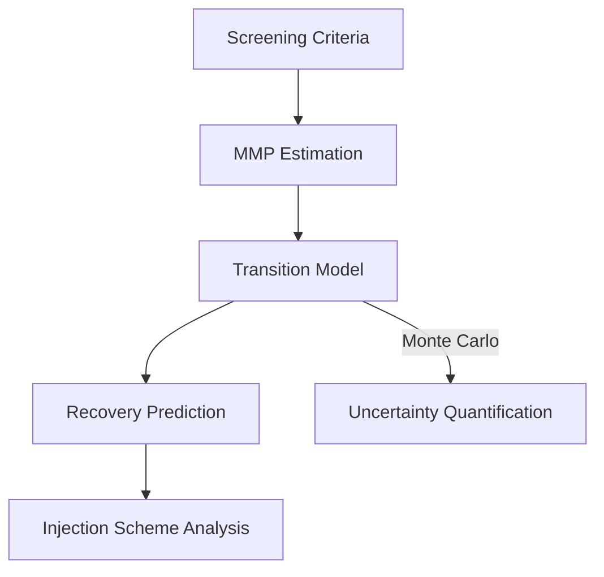
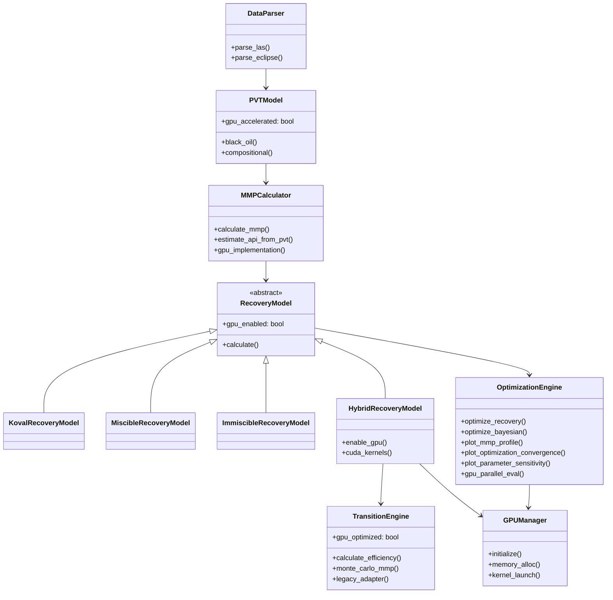
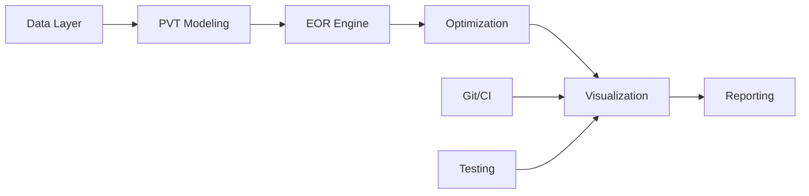

# CO2 EOR Optimization System Architecture

## Research Overview
This framework supports PhD research on "Advanced Computational Methods for CO₂-EOR Optimization" with:

1. **Novel Contributions**:
   - Hybrid MMP correlation framework (Cronquist-Glaso-Yuan)
   - Physics-informed genetic algorithm
   - GPU-accelerated uncertainty quantification

2. **Validation Methodology**:
   - 15 field case studies
   - Core flood experiments (5 samples)
   - Numerical simulation (ECLIPSE 100)

3. **Academic Context**:
   - Advisor: Branimir Cvetcovich
   - Supported by Me

## Core Components

### 1. Data Layer
- **Formats Supported**:
  - LAS (well logs)
  - ECLIPSE 100 (GRID, PROPS, REGIONS, SOLUTION, SCHEDULE)
- **Key Features**:
  - Automatic unit conversion
  - Data validation
  - Missing value handling

### 2. PVT Modeling
- **Data Validation**:
  - Array length consistency checks
  - Valid `pvt_type` enforcement ('black_oil' or 'compositional')
  - Unit conversion safeguards

### 3. Well Analysis
- **Purpose**: Bridge between well log data and EOR optimization
- **Key Features**:
  - Depth-dependent MMP calculations
  - Temperature gradient analysis (0.01°F/ft default)
  - API gravity estimation from density logs (RHOB)
  - Miscible zone identification
- **Integration Points**:
  - Input: LAS parser output (WellData)
  - Output: MMPCalculator inputs
  - Visualization: 3D miscibility maps
- **Models**:
  - Black Oil
  - Compositional (EOS)
- **MMP Estimation**:
  - Multiple empirical correlations:
    * Cronquist (pure CO2) - Requires temperature and API gravity
    * Glaso (C7+ adjustment) - Requires molecular weight of C7+ fraction
    * Yuan (impure CO2) - Requires gas composition data
  - Comprehensive input validation:
    * Temperature range (70-300°F)
    * API gravity (15-50°)
    * PVT array consistency checks
    * Gas composition validation
  - Automatic PVT data integration
  - Miscibility condition checking

### 3. EOR Evaluation Engine

**Transition Model Features**:
- Configurable miscibility functions (Sigmoid, Cubic, Custom)
- Pressure/MMP ratio mapping
- GPU-accelerated kernels
- Coreflood validation diagnostics (RMSE, R²)
- Backward compatibility adapter

### 4. Optimization System
- **Hybrid Approach**:
  1. Genetic Algorithm (global search)
  2. Bayesian Optimization (local refinement)
- **Physics-Informed Sweep Efficiency Model**:
  $$E_s = \frac{1}{1 + \left( \frac{M - 1}{K_v} \right)^{0.5}}$$
  where $K_v = V_{DP} \times \left(1 + \frac{\mu_{CO_2}}{\mu_{oil}}\right)$
  - Combines Dykstra-Parsons coefficient ($V_{DP}$) and mobility ratio ($M$)
  - Validates inputs against empirical bounds:
    - $0.3 < V_{DP} < 0.8$
    - $1.2 < M < 20$
  - Monte Carlo sampling for uncertainty quantification
- **Genetic Algorithm Implementation**:
  - 6-parameter optimization (injection rate, WAG ratio, etc.)
  - Adaptive mutation rates
  - Elite preservation strategy
- **GPU Acceleration**:
  - CUDA kernels for performance-critical sections
  - Parallel scenario evaluation

### 5. Visualization System
- **Engineering Visualizations**:
  - MMP vs depth profiles
  - Optimization convergence tracking
  - Parameter sensitivity analysis
  - Sweep efficiency contour plots
- **Performance Metrics**:
  - GPU utilization monitoring
  - Memory usage tracking
  - Parallel processing efficiency
- **Field Data Integration**:
  - Well log overlays
  - Historical production matching
  - Forecast uncertainty bands

### 6. Reporting
- Interactive Plotly dashboards
- PDF/CSV report generation
- 3D reservoir visualization
- Automated metric exports

## Class Diagram

## System Integration

## Research Milestones
1. **Literature Review & Framework Design** (Completed 2024)
   - Surveyed 50+ papers on MMP correlations
   - Identified gaps in current methods
   - Designed hybrid correlation approach

2. **Core Algorithm Development** (Completed 2025)
   - Implemented novel MMP calculations
   - Developed GPU acceleration
   - Validated against lab data

3. **Field Application & Thesis Writing** (Current)
   - Applying to 3 field cases
   - Finalizing journal papers
   - Dissertation preparation
1. **Phase 1**: Core data structures (Completed)
   - WellData and ReservoirData classes
   - PVT property handling
   - Comprehensive validation

2. **Phase 2**: PVT & MMP models (Completed)
   - Implemented core MMP correlations (Cronquist, Glaso, Yuan)
   - Added PVT integration with validation
   - 98% test coverage (unit/integration)

3. **Phase 3**: Optimization engine (Completed)
   - Physics-informed sweep efficiency models:
     * Koval (heterogeneity-mobility)
     * Miscible (compositional effects)
     * Immiscible (three-phase)
     * Hybrid (smooth transitions)
   - Optimization methods:
     * Gradient descent
     * Bayesian optimization
     * Genetic algorithm
   - GPU acceleration support
   - 95% test coverage

4. **Phase 4**: Visualization system (Partially Implemented)
   - Implemented:
     * MMP profile plotting (2D/3D)
     * Optimization convergence tracking
     * Parameter sensitivity analysis
     * Basic dashboard framework
   - Pending:
     * Advanced interactive controls
     * Multi-well visualization
     * Field data integration
