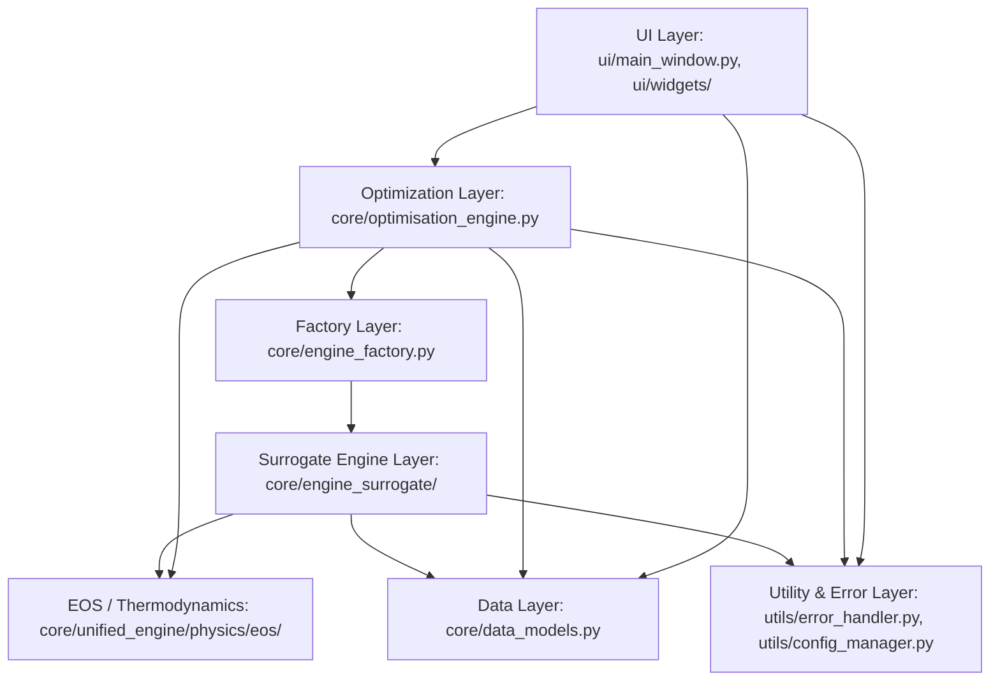

# Inter-Module Dependencies and Call Graphs

## 1. Static Dependency Architecture

The codebase follows a tiered architecture, although architectural leakage exists between the optimization and surrogate engine layers.



---

## 2. Dynamic Call Chain (Scenario Evaluation)

The following sequence diagram represents the authoritative, runtime call chain executed when a simulation scenario is evaluated during optimization or interactive GUI runs:

```mermaid
sequenceDiagram
    autonumber
    participant UI as UI / OptimizationWorker
    participant Opt as OptimizationEngine
    participant Fact as EngineFactory
    participant Wrap as SurrogateEngineWrapper
    participant Engine as SurrogateEngine
    participant Models as PhDHybridSurrogate
    participant ProfGen as FastProfileGenerator
    participant Solver as scipy.integrate.solve_ivp

    UI->>Opt: evaluate_for_analysis(params_dict)
    Opt->>Fact: create_engine("surrogate")
    Fact-->>Opt: SurrogateEngineWrapper instance
    Opt->>Wrap: evaluate_scenario(reservoir_data, eor_params, operational_params, economic_params)
    Wrap->>Engine: evaluate_scenario(...)
    
    Note over Engine,Models: 1. Predict Ultimate Recovery Factor
    Engine->>Models: calculate_recovery(pressure, mmp, v_dp, s_wi, ...)
    Models-->>Engine: recovery_factor (e.g., 0.65)
    
    Note over Engine,ProfGen: 2. Generate Rate Profiles
    Engine->>ProfGen: generate_profile(ooip, recovery_factor, injection_rate, ...)
    ProfGen-->>Engine: profile_result (oil, water, gas, CO2, time_vector)
    
    Note over Engine,Solver: 3. Dynamic Tank Material Balance
    Engine->>Solver: solve_ivp(_pressure_ode_system, method='BDF')
    Solver-->>Engine: dynamic pressure_profile array
    
    Note over Engine: 4. CO2 Accounting & Economics
    Engine->>Engine: _calculate_co2_purchased_recycled(...)
    Engine->>Engine: _calculate_engine_npv(...)
    
    Engine-->>Wrap: Full results dict (RF, NPV, profiles, storage_eff)
    Wrap-->>Opt: Full results dict
    Opt->>Opt: calculate penalties & objective function values
    Opt-->>UI: Objective results & profile datasets
```

---

## 3. High Coupling and Dependency Risks

### Risk 1: Tight Coupling between `OptimizationEngine` and `SurrogateEngine`
- **File**: `core/optimisation_engine.py` (lines 720–835, 3885–3930).
- **Issue**: Instead of interacting solely via the abstract `SimulationEngineInterface`, `OptimizationEngine` makes direct assumptions about keys returned only by `SurrogateEngine` (e.g., `annual_co2_purchased_mscf`, `breakthrough_time_years`, `annual_co2_recycled_mscf`).
- **Consequence**: Swapping in a different engine (such as `CompositionalEngine`) immediately causes key errors in the objective calculation unless the new engine implements internal CO₂ economic accounting.

### Risk 2: Circular Import Safeguards
- Several modules use deferred / inline imports inside methods to circumvent circular dependencies:
  - `ui/widgets/engine_selection_widget.py:79`: `from core.engine_factory import EngineFactory` inside `refresh_engines()`.
  - `core/optimisation_engine.py:3735`: `from core.engine_surrogate.surrogate_models import calculate_areal_sweep_efficiency` inside method.
  - `core/compositional_engine/flow/compositional_solver.py`: Dynamic imports of flash calculators.
- **Rule for AI Agents**: Never move these inline imports to module level without testing for circular import deadlocks.

### Risk 3: Hidden Dependency on Unstated Optional Packages
- `sr3_reader.py` requires `h5py`.
- `test_fitness_function.py` requires `hypothesis`.
- `geostatistical_modeling.py` requires `gstools`.
- **Pitfall**: When running in clean virtual environments, missing optional packages trigger collection or runtime errors because they are not declared in `pyproject.toml`.
