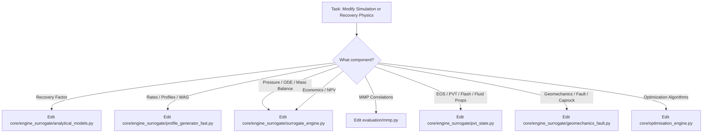

# Source-of-Truth Architecture Map

Due to iterative development and PhD research milestones, several critical physical and numerical calculations exist in multiple versions across the codebase.

This document provides the **definitive Source of Truth map** to prevent future development from editing dead or superseded files.

---

## 1. Master Source-of-Truth Matrix

| Calculation / Feature | Active Implementation (Source of Truth) | Competing / Legacy Implementations | Differences & Conflict Risks | Recommendation for AI Agents |
| :--- | :--- | :--- | :--- | :--- |
| **Simulation Scenario Evaluation** | [core/engine_surrogate/surrogate_engine.py](file:///d:/rep/4.6/co2eor_optimizer/core/engine_surrogate/surrogate_engine.py) (`SurrogateEngine`) | `deprecated/core/compositional_engine/`, `deprecated/core/unified_engine/`, `deprecated/core/engine_simple/`, `deprecated/core/engine_factory.py` | Legacy engines and EngineFactory moved to `deprecated/`. Active engine directly executes intermediate physics-informed simulation. | **Always modify `core/engine_surrogate`**. Single active production engine in the codebase. |
| **Rate Profile Generation** | [core/engine_surrogate/profile_generator_fast.py](file:///d:/rep/4.6/co2eor_optimizer/core/engine_surrogate/profile_generator_fast.py) (`FastProfileGenerator`) | `deprecated/core/simulation/profile_generator.py`, `analysis/profiler.py` | Legacy `core/simulation` modules relocated to `deprecated/`. `analysis/profiler.py` contains old heuristic clamps (e.g., 0.4–0.85 CO2 saturation near well). | **Never modify `analysis/profiler.py` or legacy profile generators**. All profiles are synthesized by `FastProfileGenerator`. |
| **Recovery Factor Calculation** | [core/engine_surrogate/analytical_models.py](file:///d:/rep/4.6/co2eor_optimizer/core/engine_surrogate/analytical_models.py) (`PhDHybridSurrogate`) | `deprecated/core/simulation/recovery_models.py` (`MiscibleRecoveryModel`, `DykstraParsonsModel`, etc.) | Legacy models relocated to `deprecated/core/simulation/`. `analytical_models.py` uses direct closed-form formulas and finite differencing. | **Modify `analytical_models.py`**. Authoritative source for all analytical recovery models. |
| **Net Present Value (NPV)** | [core/engine_surrogate/surrogate_engine.py](file:///d:/rep/4.6/co2eor_optimizer/core/engine_surrogate/surrogate_engine.py) (`_calculate_engine_npv`) | `core/objectives/economic.py` (`calculate_npv`) | `surrogate_engine.py` calculates annual CO₂ purchased and recycled directly with breakthrough awareness. `economic.py` is an unused generic utility. | **Modify `surrogate_engine._calculate_engine_npv`**. Changes to `core/objectives/economic.py` will have zero effect on optimizer evaluations. |
| **CO₂ Storage Accounting** | [core/engine_surrogate/surrogate_engine.py](file:///d:/rep/4.6/co2eor_optimizer/core/engine_surrogate/surrogate_engine.py) & [surrogate_models.py](file:///d:/rep/4.6/co2eor_optimizer/core/engine_surrogate/surrogate_models.py) | `analysis/material_balance.py` (`MaterialBalanceAnalyzer`), `core/objectives/storage.py` | `surrogate_engine` uses residual trapping + structural + solubility. `material_balance.py` previously had a double-subtraction defect for recycled gas (now resolved). | For optimizer evaluations, **`surrogate_engine` is authoritative**. `material_balance.py` is used in post-simulation analytical reporting. |
| **Objective Function Evaluation** | [core/objectives/wrapper.py](file:///d:/rep/4.6/co2eor_optimizer/core/objectives/wrapper.py) (`_calculate_objective_functions`) | `core/objectives/economic.py`, `core/objectives/storage.py` | Calculates RF, NPV, storage efficiency, and CO₂ utilization from simulation profiles. Missing/unphysical data returns `NaN`. | **`wrapper.py` is authoritative** for GA/BO scoring. Class E synthetic modifiers and magic number fallbacks are completely eliminated. |
| **Geological Modeling** | [core/geology/geostatistical_modeling.py](file:///d:/rep/4.6/co2eor_optimizer/core/geology/geostatistical_modeling.py) (`create_geostatistical_grid`) | `deprecated/core/geology/geology_engine.py` (`GeologyEngine`) | Uncalibrated `GeologyEngine` moved to `deprecated/core/geology/`. Active grid generation routes through geostatistical modeling. | **Modify `geostatistical_modeling.py`**. |
| **Deck Export (CMG)** | Retired / Purged | `utils/cmg_exporter.py`, `core/simulation/simulator_exporter.py` | Standalone deck exporter was retired due to uncalibrated components and unit scaling risks. | **Retired**. |
| **Minimum Miscibility Pressure (MMP)** | [evaluation/mmp.py](file:///d:/rep/4.6/co2eor_optimizer/evaluation/mmp.py) (`calculate_mmp`, `MMPParameters`) | `core/engine_surrogate/analytical_models.py` | `evaluation/mmp.py` provides 5 validated literature correlations (Cronquist 1978, Yellig & Metcalfe 1980, Alston et al. 1985, Yuan et al. 2005, Lee 1979). `analytical_models.py` delegates directly to `evaluation/mmp.py`. | **`evaluation/mmp.py` is the single source of truth** across the entire codebase. Inline duplication in `analytical_models.py` has been eliminated. |
| **Equation of State (EOS) & Fluid Characterization** | [core/engine_surrogate/pvt_state.py](file:///d:/rep/4.6/co2eor_optimizer/core/engine_surrogate/pvt_state.py) (`SolventExtendedPVTEngine`) | `deprecated/core/unified_engine/physics/eos/` (`PengRobinsonEOS`, `ReservoirFluid`) | Primary engine uses self-contained cubic Peng-Robinson solver for real CO₂ density, FVF ($B_{\text{CO2}}$), and flash separation. Legacy EOS deprecated. | **`core/engine_surrogate/pvt_state.py` is authoritative** for all active EOS, density, and solvent PVT state calculations. |
| **Visualizations & Charts** | Direct `plotly` and `matplotlib` modules | Legacy dummy mock classes in `analysis/material_balance.py` (deleted) | Hard requirements verified at startup. Dummy mock classes that swallowed plot rendering are eradicated. | **Direct imports only**. Plotly and Matplotlib must never be mocked with silent no-op stubs. |
| **Optimization & Diagnostic Plotting** | [core/plotting_manager.py](file:///d:/rep/4.6/co2eor_optimizer/core/plotting_manager.py) (`PlottingManager`) | Duplicate plotting functions scattered in legacy analysis scripts | Centralized manager for well schedules, coverage (trend/min/max), Euclidean distance heatmaps, and Pareto fronts. | **Always modify `core/plotting_manager.py`**. Ensure bar intervals use overlay mode with width=duration. |
| **Run Data Export & Reporting** | [utils/run_exporter.py](file:///d:/rep/4.6/co2eor_optimizer/utils/run_exporter.py) (`RunDataExporter`) | `utils/report_generator.py` | Generates comprehensive run manifests, results summaries, and markdown reports with closed-loop mass balance. | **Modify `utils/run_exporter.py`**. Evaluates closed-loop gross mass balance $>99.9\%$. |
| **Decline Curve Analysis (DCA)** | [analysis/decline_curve_analysis.py](file:///d:/rep/4.6/co2eor_optimizer/analysis/decline_curve_analysis.py) (`DeclineCurveAnalyzer`) | Inline regression snippets | Implements plateau onset detection ($q < 0.95 q_{\text{peak}}$) and fits Arps models strictly to boundary-dominated decline. | **Modify `analysis/decline_curve_analysis.py`**. Preserves plateau before fitting Arps models. |
| **Solvent-Extended PVT State** | [core/engine_surrogate/pvt_state.py](file:///d:/rep/4.6/co2eor_optimizer/core/engine_surrogate/pvt_state.py) (`SolventExtendedPVTEngine`) | `deprecated/core/compositional_engine/`, `core/data_models.py` | Decouples transport saturation ($S_g$) from composition ($x_{\text{CO2}}$), evaluates analytical PR-EOS for pure supercritical CO₂ density, swelling $S_F$, and flash separation. | **Modify `core/engine_surrogate/pvt_state.py`**. Authoritative for surrogate fluid property updates. |
| **Geomechanics & Fault/Caprock Integrity** | [core/engine_surrogate/geomechanics_fault.py](file:///d:/rep/4.6/co2eor_optimizer/core/engine_surrogate/geomechanics_fault.py) (`GeomechanicsFaultModel`) | `deprecated/core/unified_engine/geomechanics/` | Evaluates horizontal stress path ($\Delta \sigma_h = \gamma_h \Delta P$), Mohr-Coulomb slip tendency $T_s$, caprock tensile/shear limits, and dynamic leakage. | **Modify `core/engine_surrogate/geomechanics_fault.py`**. Authoritative for containment checks and seal leakage rates. |
| **Viscous Fingering & Fractional Flow** | [core/engine_surrogate/profile_generator_fast.py](file:///d:/rep/4.6/co2eor_optimizer/core/engine_surrogate/profile_generator_fast.py) & [analytical_models.py](file:///d:/rep/4.6/co2eor_optimizer/core/engine_surrogate/analytical_models.py) | `tests/scientific/co2/` old inverted fractional flow (SCI-FLAW-01) | Inverted fractional flow had unphysical $df_g/dM < 0$. Active implementation enforces authentic monotonic Koval factor $K = H_k \cdot E_{\text{eff}}$ and $f_g = K S / (1 + S(K-1))$. | **Modify `profile_generator_fast.py` and `analytical_models.py`**. Guarantees adverse mobility monotonically accelerates breakthrough. |
| **Standardized 4-Stream Fluid Profiles** | [core/engine_surrogate/surrogate_engine.py](file:///d:/rep/4.6/co2eor_optimizer/core/engine_surrogate/surrogate_engine.py) | Ad-hoc profile keys across UI widgets | Standardizes dictionary outputs for (1) Crude oil (STB), (2) Natural gas (MSCF, separating CO₂ and solution gas), (3) Water (bbl & water cut), and (4) Injection agent (CO₂ & WAG water with compressor bottlenecks). | **`surrogate_engine.py` is authoritative** for output profile dictionary structure. |

---

## 2. Source-of-Truth Decision Tree for Developers

