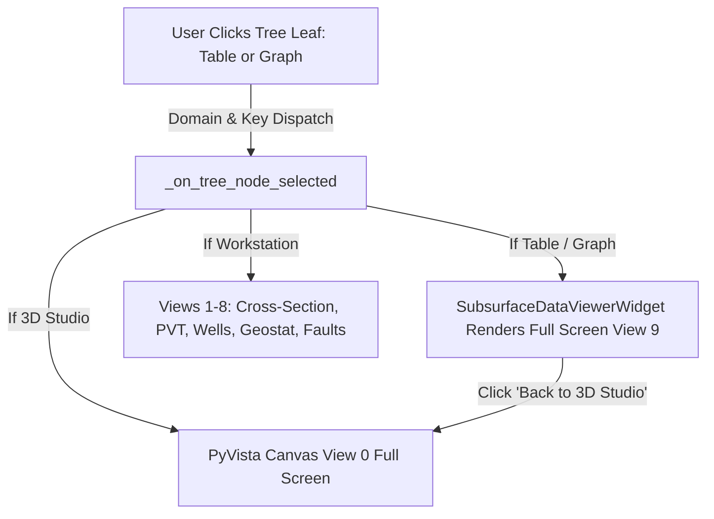

# Accessible Subsurface Studio Architecture (Model Tree + Contextual Property Grid)

> [!NOTE]
> This document specifies the architectural paradigm for the **Accessible 3D Subsurface Studio Workbench** (`ui/workbench/`), replacing the legacy dual-splitter panels with a professional CAD/simulation engineering workspace (Petrel/CMG/Blender style).

---

## 1. Architectural Paradigm: The 3-Zone Unobstructed Studio

Complex reservoir studies demand that engineers can configure foundational parameters without visual obstruction and without "tab ping-pong". Rather than floating transient overlays or rigid side-by-side tab splits, the Subsurface Studio operates on a **3-zone docked workspace**:

```
┌────────────────────────────────────────────────────────────────────────────────────────────────────────┐
│ CENTER WORKSTATION STACK: Single Active View (3D Studio | Cross-Section | PVT | Wells | Sheets/Graphs) │
├────────────────────┬───────────────────────────────────────────────────┬───────────────────────────────┤
│ MODEL TREE         │ CENTER WORKSTATION (FULL HEIGHT 100% VIEWPORT)    │ CONTEXTUAL PROPERTY GRID      │
│ (Left Dock, 260px) │ (Center View Stack 0-9, 100% Height, No Drawer)   │ (Right Dock, 388-550px)       │
│                    │                                                   │ (Auto-hidden on Sheets/Dash)  │
│ - Reservoir        │  [ View 0: 3D Studio - Native PyVista Viewport ]  │  Active: "Permeability X"     │
│   - Grid Dim       │  [ View 1: Geology Cross-Section 2D Canvas ]      │  Value:      [ 150.0 ] mD     │
│     Grid Table     │  [ View 2: Geostatistics Variogram Workstation ]  │  Distribution: Gaussian       │
│     Grid Graph     │  [ View 3: Corey Rel-Perm & Welge Displacement ]  │  Range:      [ 1200.0 ] ft    │
│   - Volumetrics    │  [ View 4: 3D Fault Slip & Geomechanics ]         │  ──────────────────────────── │
│     OOIP Table     │  [ View 5: Model Quality Assurance (QA/QC) Gate ] │  [ Apply & Sync to Project ]  │
│     OOIP Graph     │  [ View 6: Multi-Domain Surveillance Dashboard ]  │                               │
│ - Petrophysics     │  [ View 7: Fluids & PVT Thermodynamics Workstation│                               │
│   - Rock / Relperm │  [ View 8: Well Network Workstation (Full Screen)]│                               │
│ - Well Network     │  [ View 9: Subsurface Data & Graph Viewer Sheet ] │                               │
│   Master Inventory │                                                   │                               │
│   - [PROD] Well-1  │                                                   │                               │
│     Trajectory     │                                                   │                               │
│     IPR Curve      │                                                   │                               │
└────────────────────┴───────────────────────────────────────────────────┴───────────────────────────────┘
```

---

## 2. Core Architectural Pillars

### 2.1 Zone 1: Hierarchical Model Tree with Attached Sheets & Graphs (`ui/workbench/components/model_tree_widget.py`)
- Acts as the project's structural mental map with attached engineering items:
  - Parent nodes contain attached child nodes for **Sheets & Tables** and **Graphs**.
  - High-DPI vector icons (`table`, `graph`, `well_prod`, `well_inj`, `faults`, `uic`, `pvt`, `geostat`).
  - Selecting any attached sheet, table, or graph immediately renders it in **full screen in the middle** with a breadcrumb header and navigation back to 3D Studio.

### 2.2 Zone 2: Native PyVistaQt 3D Viewport (`ui/workbench/components/pyvista_reservoir_canvas.py`)
- Powered by `pyvista` and `pyvistaqt` (`QtInteractor`).
- Full 100% viewport height with **zero bottom drawer obstruction**.
- **Volumetric Reservoir Mesh**: Full `pv.StructuredGrid` with hexahedral cell blocks and scalar property colormaps (Permeability, Porosity, Saturation, Pressure).
- **True 3D Wellbores**: Continuous 3D spline tubes with gold perforation collar sleeves.
- **Sub-Millisecond Hardware Raycast Picking**: Wellbore tubes and reservoir cells raycast-picked in real time.

### 2.3 Zone 3: Full-Screen Subsurface Data & Graph Workstation Viewer (`ui/workbench/components/subsurface_data_viewer_widget.py`)
- Dedicated full-screen View 9 in `self.center_stack`.
- **Interactive Spreadsheet View (`QTableWidget`)**:
  - Live text search and filtering across all columns.
  - "Copy Table (TSV)" one-click export for Excel/Notepad.
  - "Export CSV" file export.
  - Alternating row zebra striping and aligned numerical formatting.
- **Scientific 2D Graph View (`FigureCanvasQTAgg`)**:
  - High-resolution matplotlib canvas with formatted gridlines and legends.
  - "Save Graph (PNG)" high-DPI image export.
- Generators for all domain sheets and graphs:
  - Grid Coordinates & Layer Tops
  - Volumetric OOIP & HCPV Material Balance
  - Stratigraphic Zonal Tops
  - Petrophysical Summary & Porosity-Permeability Cross-Plot
  - Corey Relative Permeability Endpoints
  - Geostatistical Variogram Parameters
  - Black Oil Numerical PVT Table
  - Solvent Swelling & Viscosity Reduction Data Table
  - Minimum Miscibility Pressure (MMP) Benchmark Correlations Table
  - 10-Component Detailed PR-78 Composition Table
  - Fluid Contacts & Hydrostatic Depth Table
  - Master Well Network Inventory Schedule
  - Individual Well Deviation Surveys & Trajectory Tables
  - Caprock Geomechanical Properties & Mohr-Coulomb Envelopes
  - Fault Slip Tendency & SGR Analysis Table
  - EPA Class VI Safe Injection Ceilings & In-Situ Stress Gradient Graphs

### 2.4 Removal of Diagnostic Drawer
- The diagnostic bottom drawer has been completely removed to provide 100% unobstructed full-screen height for all middle views and workstations.

---

## 3. Bi-Directional Event Flow



---

## 4. Subsystem File Layout

```
ui/workbench/
├── subsurface_workbench_widget.py          # Master Workbench container (Tree + 10 Center Stack Views + Auto-collapsing Right Panel)
├── components/
│   ├── model_tree_widget.py                # Hierarchical tree with attached Table and Graph nodes
│   ├── subsurface_data_viewer_widget.py    # Full-screen interactive spreadsheet & scientific graph viewer
│   ├── pyvista_reservoir_canvas.py         # Native PyVistaQt 3D Viewport with hardware raycast picking (100% Height)
│   ├── contextual_property_grid.py         # Bounded property sheet with real-time validation and sync
│   ├── visual_audit_gate_widget.py         # Native QA/QC verification gate
│   ├── fault_caprock_manager_dialog.py     # Multi-fault network, inter-fault stress transfer, and caprock dialog
│   └── subsurface_icons.py                 # Vector-drawn high-DPI QIcon generators (table, graph, well, etc.)
```

---

## 5. Parameter Input Side Panel, Faults & Caprock Containment

### 5.1 Bounded Parameter Side Panel & Input Box Outline Styling
- **Viewport Protection**: The center 3D viewport is marked un-collapsible (`setCollapsible(1, False)`). The parameter input panel is constrained between `min=330px` and `max=460px` when expanded, preventing accidental takeover or concealment of the 3D studio.
- **Vertical Toggle Button Strip (`toggle_strip`)**: A 28px vertical bar holding `btn_toggle_params` provides 1-click collapse to a sleek 32px bar and instant restoration to 370px.
- **Clean Flat Panel & Crisp Input Outlines**:
  - The parameter panel frame and vertical toggle strip are completely borderless (`border: none;`).
  - Strict, high-contrast borders are applied exclusively to editable input elements: `QLineEdit`, `QDoubleSpinBox`, `QSpinBox`, and `QComboBox`. Spinboxes include dedicated subcontrols and padding to ensure numeric values and unit badges never overlap.

### 5.2 Fault Parameter Suite & 3D Realistic Geometry
- **Editable Properties**: Fault Name/ID, Dip angle ($10^\circ - 90^\circ$), Strike angle ($0^\circ - 360^\circ$), Transmissibility multiplier ($0.0 - 1.0$), Throw / Displacement ($0 - 500\text{ ft}$), Friction coefficient $\mu$ ($0.1 - 1.0$), Cohesion $S_0$, and center coordinates $(X, Y)$.
- **Mohr-Coulomb Slip Stability**: Dynamic calculation and readout of slip tendency $T_s = \tau / \sigma_n'$ with stability classification.
- **3D Quad Plane**: Rendered as an authentic oriented quad mesh cutting cleanly across reservoir layers.

### 5.3 Caprock Positioning & Geological Styling Standard
- **Elevation Inversion Invariant**: In VTK/OpenGL Cartesian space, $+Z$ is UP, whereas geological depth (TVD) increases downwards. Elevation must be mapped as $Z_{\text{vis}} = -TVD$. Consequently, shallower confining units ($Z \in [-5000, -4850]$ ft) are positioned strictly **above** the reservoir interval ($Z \in [-5050, -5000]$ ft).
- **Petrel / CMG Visual Conventions**:
  - **High-Contrast Sealing Interface**: A distinct cyan sealing contact horizon plane (`#00f2fe`, opacity 0.95, line width 2.0) is rendered at $Z = -top\_depth$.
  - **Lithology-Specific Shading**: Dense marine shale is rendered in dark slate-navy (`#1e293b`, opacity 0.72, edge wireframe `#38bdf8`), anhydrite/evaporite in crystalline ice-lavender (`#3b4252`, edge `#81a1c1`), siltstone in olive-slate (`#334155`), and dense carbonate in deep teal-slate (`#264653`).
  - **3D Billboard CAD Badge**: Displays lithology type, thickness, and capillary entry pressure $P_{\text{entry}}$ directly above the formation.

### 5.4 3D Viewport Camera Preservation Protocol
- **Smooth Parameter Tweaking (Zero View Jumps)**: On the initial render, the camera centers on the newly constructed reservoir geometry (`view_isometric()`, `reset_camera()`, `zoom(0.85)`).
- **State Tracking (`_has_rendered_mesh`)**: On all subsequent parameter edits, colormap adjustments, property changes, or overlay toggles, the user's active camera position is preserved before rebuilding actors and restored immediately afterwards. The user never loses their chosen vantage point or zoom level.

### 5.5 Stratigraphy & Cross-Section Viewport Enhancements
- **Spacious Horizontal Top Toolbar**: Eliminates vertical squishing. Hosts orientation selector, property dropdown, colormap selector, overlay checkboxes (Caprock Seal, Wells & Perfs, Fault Trace, Sub-Layers), stepping buttons, smooth slider, slice coordinate badge, and a center reset button.
- **Index Preservation**: Slice position is cached and preserved during property updates and view switching (`_update_slider_range(preserve_value=True)`).
- **True TVD Axis & Data Fidelity**: Renders authentic reservoir intervals with depth increasing downwards, overlying caprock seal layer with shale hatching, projected wellbores with perforation sleeves, and fault trace with slip throw displacement.

### 5.6 Universal Right-Click Context Menus
- **Viewport Canvas**: Right-click brings up actions for camera angle presets, resetting camera, selecting active scalar property, colormap palettes, slicing modes, overlay toggles, and PNG export.
- **Cross-Section Canvas**: Right-click provides instant orientation switching (In-line, Cross-line, Areal, VPC), palette controls, overlay toggles, center slice jumping, and high-res export.
- **Hierarchical Model Tree**: Right-click context menu provides domain-specific engineering actions (`Add Well`, `Add Stratigraphic Layer`, `Run Model QA/QC Audit`, `Synchronize Model Data`, `Expand All`, `Collapse All`).
- **Corey Rel-Perm Canvas**: Right-click menu provides Copy Image, Save Plot (PNG/PDF), Export Rel-Perm CSV Table, Toggle Semi-Log Scale, Toggle Grid, and Reset View.
- **Geostatistics Canvas**: Right-click menu provides Copy Image, Save Plot (PNG/PDF), Export SGS Realization Grid (CSV), Export Semivariogram Table (CSV), Toggle Colorbar, Toggle Grid, and Reset Zoom.

### 5.7 Corey Relative Permeability & Geostatistical Middle-Screen Workstations
- **Dedicated Middle-Screen Workstation (View 3)**:
  - Relative permeability plots relocated from cramped side panels to a dedicated full-width workstation (`CoreyRelPermWorkstationWidget`).
  - Supports Dual-System plots (Water-Oil and Gas-Liquid), Buckley-Leverett Fractional Flow with Welge tangent line ($S_{wf}, \bar{S}_{w,BT}$, recovery efficiency $E_D$), Advancing Saturation Shock Profile $S_w(x_D)$, and Comparative Wettability Overlay with Craig's rule crossover diagnosis ($S_w^*$).
- **Geostatistics Visualizer & Physical Variogram Scaling (View 2)**:
  - Top panel simplified: numerical parameter spinboxes moved to the side panel; top bar retained strictly for plotting settings.
  - Physical unit alignment: Lag distance $h$ is converted from grid cells to reservoir feet ($h = \text{cells} \times \Delta x$).

### 5.8 Structural Fault System & Caprock Confining Seal Architecture
- **Dedicated Manager Window (`FaultAndCaprockDialog`)**:
  - Full structural setup accessible from central header and property grid.
  - Tab 1: Structural Fault System Manager with `+ Add Fault`, `Duplicate`, `Delete`, and structural presets (Conjugate Graben, Step-Faults, Relay Segments, Single Major Boundary).
  - Tab 2: Multi-Fault Coulomb Stress Transfer ($\Delta CFS = \Delta \tau - \mu(\Delta \sigma_n - \Delta P)$) interaction matrix and dislocation attenuation canvas.
  - Tab 3: Caprock Confining Stratigraphy with lithology, mechanical moduli, and live EPA Class VI containment cards.
- **Dynamic Model Tree Fault Items**:
  - Each fault appears dynamically under `Structural Geology & Faults` as `[FLT] {name}` with sub-nodes:
    - `Geometry & Kinematics (Table)`
    - `Isolated 3D Fault Surface (3D View)`
    - `Slip Tendency & Reactivation (Graph)`
    - `Juxtaposition & SGR Profile (Graph)`
- **Isolated Fault 3D Mode**:
  - Renders the reservoir outer envelope as a faint bounding wireframe (`opacity=0.35`) while prominently rendering the selected 3D fault surface with SGR colormap, dip arrows, and strike traces.
- **Geomechanical Reservoir Coupling**:
  - Multi-fault cumulative structural offset (summing throw $\Delta Z_i$ and heave $d_{\text{heave}, i}$).
  - Damage zone petrophysical permeability and porosity modulation.

### 5.9 Data Management Tab Status & Roadmap
- **Current Status**: Active development in progress (`ui/data_management_widget.py`).
- **Pending Updates**:
  1. QA/QC Modernization: Synchronize with the new `ModelQualityAssuranceWidget` and eliminate legacy "Pre-Flight" references.
  2. UI/UX Polish: Remove custom inline CSS in favor of clean standard Qt design.
  3. Bugfixes & Invariant Hardening: Robust handling of grid permeability formats (scalar, 1D flattened, and 3D arrays via `PERMX.flat[0]`) and complete round-trip serialization.

---

## 6. Visual Verification Artifacts

The following interface screenshots have been verified and archived:

- `scratch/bench_fault_caprock_dialog_tab1.png`: Fault & Caprock Manager Dialog (Tab 1: Structural Fault System)
- `scratch/bench_fault_caprock_dialog_tab2.png`: Fault & Caprock Manager Dialog (Tab 2: Inter-Fault Stress Transfer)
- `scratch/bench_fault_caprock_dialog_tab3.png`: Fault & Caprock Manager Dialog (Tab 3: Caprock Confining Stratigraphy)
- `scratch/bench_fault_system_table_view.png`: Master Fault Inventory Table View
- `scratch/bench_fault_inter_stress_view.png`: Inter-Fault Coulomb Stress Transfer Graph View
- `scratch/bench_current_qa_qc_gate.png`: Model Quality Assurance Gatekeeper View
- `scratch/bench_data_management_tab.png`: Data Management Tab (In Development)


