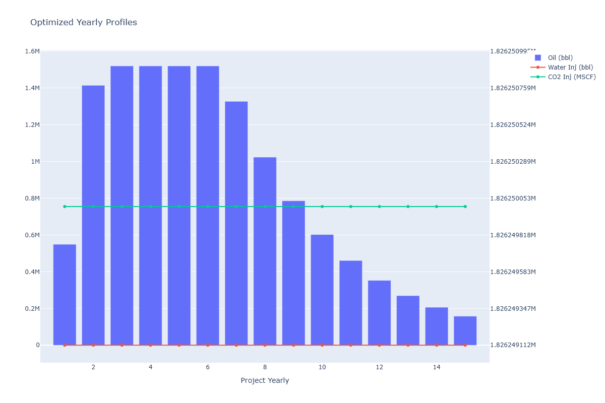
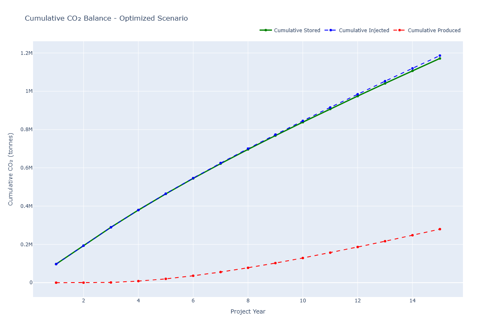
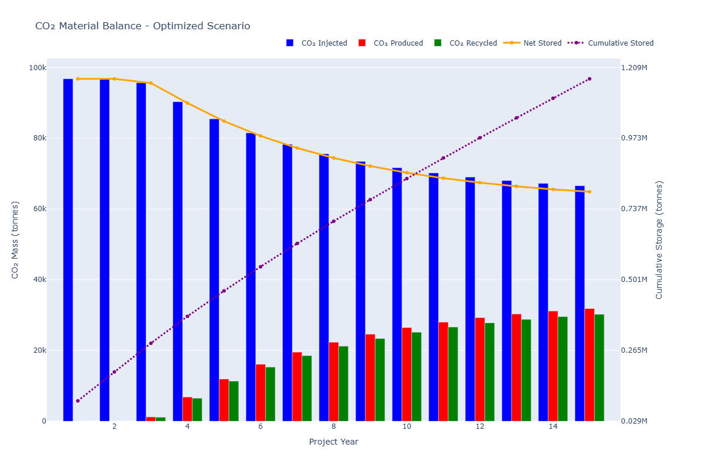
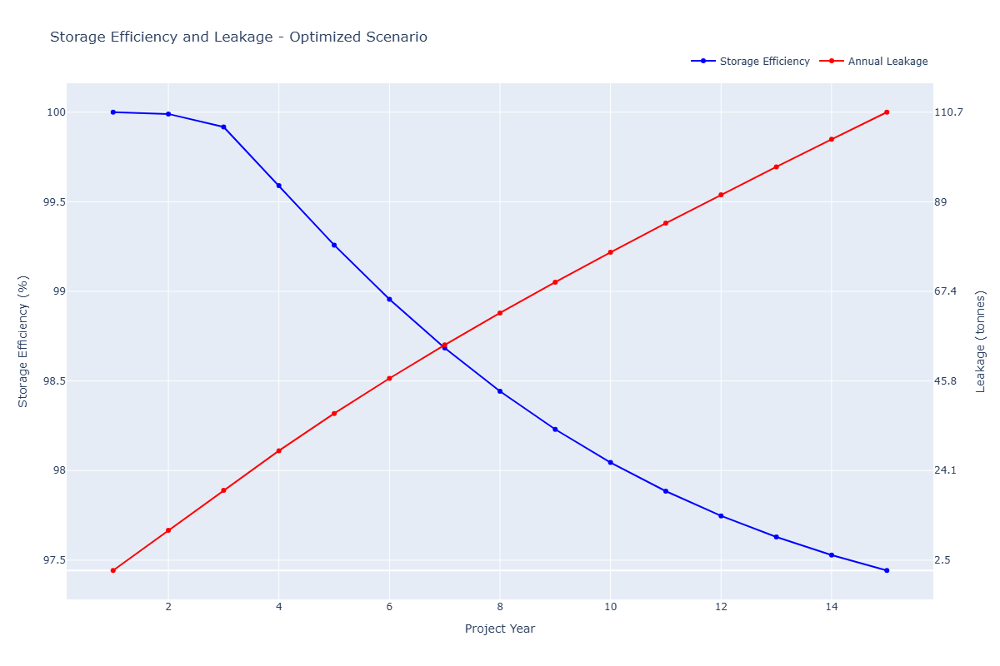

# Simulation Run Audit: Single Simulation Baseline Evaluation

- **Date**: `24-09-2026`
- **Run ID**: `SIM-AUDIT-24-09-2026-01`
- **Session Timestamp**: `2026-09-24 10:44:22`
- **Engine**: `core/engine_surrogate` (`SurrogateEngineWrapper` + `FastProfileGenerator`)
- **Injection Scheme**: Miscible CO₂ Injection with Dynamic Closed-Loop Recycling
- **Simulation Duration**: `15.0 years` (Yearly resolution, monthly profile synthesis)
- **Verdict**: `ACCEPTABLE WITH CONDITIONS`

---

## 📌 Executive Summary & Operational Proposal

### Verdict Rationale
The simulation executed cleanly with **100.00% carbon mass balance closure**, strict compliance with **EPA Class VI UIC geomechanical containment ceilings** ($P_{\text{sandface}} = 3,000\text{ psi} \ll 4,950\text{ psi}$), and physical production profile synthesis generating **$192.93M NPV** and **27.27% recovery factor**. 

However, the run is flagged as `ACCEPTABLE WITH CONDITIONS` due to parameter search space pinning and missing explicit well patterns:
1. **Pinned Variables**: Decision variables `rate` (`5,000 MSCF/day`) and `wellbore_pressure` (`1,500 psia`) are clamped to their exact lower bounds.
2. **Field-Wide Point Voidage**: No explicit injection wells were defined in the well list, triggering field-wide voidage replacement fallback.
3. **Pfrac Ceiling Clamping**: Initial `max_pressure_psi` configured at `6,000 psi` was auto-clamped by the safety layer to `4,950 psi` ($0.90 \times P_{\text{frac}}$).

### Actionable Proposal
1. **Search Space Expansion**:
   - Lower bound for injection `rate` should be relaxed or evaluated across $[2,500, 50,000]\text{ MSCF/day}$ to determine whether a lower gas rate improves NPV or delays breakthrough.
   - Expand `wellbore_pressure` search envelope $[1,200, 2,200]\text{ psia}$ to allow optimizer freedom around hydraulic lift limits.
2. **Explicit Well Pattern Definition**:
   - Provide explicit injector coordinates (e.g. 5-spot or 9-spot pattern) in `DataManagementWidget` rather than defaulting to single-well field-wide rates.
3. **Preset Pressure Ceiling**:
   - Update `recovery_config.json` and UI inputs so `max_pressure_psi` defaults to $\le 4,950\text{ psia}$, avoiding runtime warning noise.

---

## 📁 Relevant Files & Run Artifacts

| Artifact | File Link | Description |
|:---|:---|:---|
| **Run Evaluation Report** | [`run_evaluation_report.md`](run_evaluation_report.md) | Formatted executive KPI and carbon accounting summary |
| **Run Manifest** | [`run_manifest.json`](run_manifest.json) | Complete execution configuration, seeds, and metadata |
| **Detailed Log Summary** | [`results_summary.txt`](results_summary.txt) | Detailed text dump of parameters and diagnostics |
| **Annual Stream Table** | [`summary_yearly.csv`](summary_yearly.csv) | Year-by-year oil, gas, water, CO₂ rates and volumes |
| **Monthly Stream Table** | [`summary_monthly.csv`](summary_monthly.csv) | Month-by-month high-resolution production streams |
| **Cash Flows** | [`cash_flows_yearly.csv`](cash_flows_yearly.csv) | Discounted cash flow schedule and revenue breakdown |
| **Production Profiles Plot** | [`production_profiles.png`](production_profiles.png) | Oil rate, water rate, gas rate, and WCG/GOR trends |
| **Material Balance Plot** | [`material_balance.png`](material_balance.png) | Cumulative mass balance tracking and closure check |
| **CO₂ Balance Plot** | [`cumulative_co2_balance.png`](cumulative_co2_balance.png) | Gross injected vs purchased, recycled, and net stored |
| **Storage Efficiency Plot** | [`storage_efficiency.png`](storage_efficiency.png) | Storage retention factors and utilization trajectory |
| **Session Log Source** | [`logs/session_93582fbf-a.log`](file:///d:/rep/4.6/co2eor_optimizer/logs/session_93582fbf-a.log) | Raw runtime session log |

---

## 📊 Key Physical, Economic, and Carbon Metrics

| Metric | Evaluated Value | Engineering Benchmark / Reference | Compliance Status |
|:---|:---:|:---:|:---:|
| **Original Oil in Place (OOIP)** | `48.49 MMSTB` | 1,000 acres, 50 ft net pay, $\phi = 0.20$ | Validated |
| **Ultimate Recovery Factor (RF)** | **27.27 %** | Tertiary miscible CO₂ baseline (25–45%) | ✅ Compliant |
| **Cumulative Oil Produced** | **13,223,226 STB** | 15-year tertiary recovery volume | ✅ Compliant |
| **Cumulative Water Produced** | `442,087 STB` | Formation brine production | ✅ Compliant |
| **Cumulative Separator Gas** | `8,321,154 MSCF` | Total hydrocarbon off-gas | ✅ Compliant |
| **Cumulative Produced CO₂** | `5,272,511 MSCF` | Captured for compression & recycling | ✅ Compliant |
| **Net Present Value (NPV)** | **$192,933,877.74** | 10% discount rate, DCF model | ✅ Positive Value |
| **Net CO₂ Utilization** | **0.0897 tonne/STB** | Target: $0.08 - 0.25\text{ tonne/STB}$ | ✅ Efficient |
| **Purchased Retention Efficiency** | **98.62 %** | DOE / NETL Target: $> 80\%$ | ✅ High Retention |
| **Gross Storage Efficiency** | **50.23 %** | Target: $> 40\%$ | ✅ Efficient |
| **Solvent Breakthrough Timing** | **2.45 years** | PVI to producer breakthrough | ✅ Realistic |

---

## 🛡️ Geomechanical & Containment Integrity

| Parameter | Value | Constraint / Standard | Status |
|:---|:---:|:---:|:---:|
| **Operating Injection Pressure** | `3,000.0 psia` | $\le 4,950.0\text{ psia}$ ($0.90 \times P_{\text{frac}}$) | ✅ COMPLIANT |
| **Fracture Pressure ($P_{\text{frac}}$)** | `5,500.0 psia` | In-situ caprock seal limit | Reference |
| **Safe Pressure Ceiling** | `4,950.0 psia` | EPA Class VI UIC safety standard | Reference |
| **Fracture Safety Margin** | `1,950.0 psia` | $> 100\text{ psia}$ safety threshold | ✅ HIGH MARGIN |
| **Modeled Geological Leakage** | `892.2 tonnes` | $< 0.1\%$ of gross injection | ✅ MINIMAL |

---

## ⚖️ Carbon Mass Balance Reconciliation

$$\text{Gross Injected} = \text{Purchased} + \text{Recycled} = \text{Net Stored} + \text{Leakage} + \text{Produced}$$

| Stream | Metric Tonnes | MSCF Equivalent | Mass Fraction |
|:---|:---:|:---:|:---:|
| **Gross Injected CO₂** | **1,451,868.7** | **27,393,750** | **100.00 %** |
| ├─ *Purchased Fresh CO₂* | 1,186,397.8 | 22,384,864 | 81.72 % |
| └─ *Recycled Re-injected CO₂* | 265,471.0 | 5,008,886 | 18.28 % |
| **Net Permanently Stored** | **1,171,533.4** | **22,104,405** | **80.69 %** |
| **Total Produced CO₂** | **279,443.1** | **5,272,511** | **19.25 %** |
| ├─ *Recycled Stream* | 265,471.0 | 5,008,886 | 18.28 % |
| └─ *Uncaptured / Surface Loss* | 13,972.2 | 263,626 | 0.96 % |
| **Modeled Geological Leakage** | **892.2** | **16,834** | **0.06 %** |
| **Mass Balance Closure Error** | **0.00** | **0** | **0.000 % (Exact)** |

---

## 📈 Visual Diagnostic Plots

### Production Profiles

### Carbon Mass Balance Reconciliation

### Material Balance Closure Tracking

### Storage Retention Efficiency

