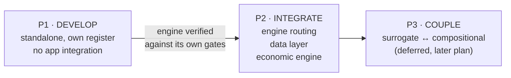

# Vision and Phases

**Restated 07-10-2026 by the project owner.** This page is the authoritative statement of *why* the
compositional engine exists and *how the work is phased*. It supersedes the framing in earlier pages.

---

## 1. Why a second engine

The application has **one** engine today: a **surrogate** — a deliberately simplified, fast engine built
for optimisation loops where thousands of evaluations are needed per run.

During development it became clear that **no available simulator covers the full spectrum of this
project's tasks.** The surrogate's simplifications are acceptable for *ranking* candidate operating
points, and unacceptable for *evaluating* one. A full-physics engine is therefore needed, and Rust is
the chosen implementation language.

> The two engines have **different jobs**, not different quality levels:
>
> | | Surrogate | Compositional |
> |---|---|---|
> | **Job** | Fast screening and ranking | Full-physics evaluation **and** generating training data for a neural surrogate |
> | **Call volume** | $10^3$–$10^5$ per optimisation run | A handful per run |
> | **Physics** | Reduced-order, curve-driven | Solved: transport + phase equilibrium |
> | **Acceptable simplification** | Yes | **No** |
> | **Status** | Shipped, active | **Not started** |

### 1.1 The compositional engine also **trains** the surrogate

> *"to 'teach' surrogate engine neural network (yet to be developed) for current reservoir per user
> request"*

The compositional engine's second job is **generating the labelled dataset that trains a per-reservoir
neural surrogate** (not yet built). This is why **INV-4** exists, and why its output schema is a **P1**
decision rather than a P2 one — see [`engine_invariants.md`](engine_invariants.md) §4.

### 1.2 Prior art: a Python attempt was made and removed

An `EngineFactory` **and a Python compositional engine were built, then deleted** after the attempt
failed. Rust is the second attempt at the same goal. Full record — including why
`agent_wiki/development/extension_points.md` currently documents a deleted component, and what lessons
to carry forward — in [`engine_invariants.md`](engine_invariants.md) §6.

### 1.3 Mandatory invariants

Decided 07-10-2026, non-negotiable. Full text in
[`engine_invariants.md`](engine_invariants.md):

| ID | Invariant | Decided |
|---|---|---|
| **INV-1** | **Fail loudly. Never fall back.** Every error returns a typed error and **stops** | 07-10 |
| **INV-2** | **Runs only when the user starts it** — no automatic invocation, no dispatch heuristic | 07-10 |
| **INV-3** | **Simulation only** — no NPV, costs or prices. A separate economic engine owns those | 07-10 |
| **INV-4** | **Output is training-ready** — labelled $(x,y)$ pairs, full fields, versioned, provenance | 07-10 |
| **INV-5** | Own flaw register, `COMP-nn` namespace | 07-10 |
| **INV-6** | **Capability declaration vs. failure** — `NOT_IMPLEMENTED` ≠ `FAILED` | 08-10 |

### 1.4 Data layer — decided

**Simulation output:** layered open file substrate — `petekIO` (L1, in memory) · **HDF5/VTK-HDF +
RESQML 2.0.1/GRDECL** (L2, spatial) · **DuckDB/SQLite + Parquet/Arrow** (L3, tabular).
**Project data:** **PostgreSQL + `pgvector`**.
Schema: [`output_schema.md`](output_schema.md). Database: [`data_architecture.md`](data_architecture.md).

> ✅ Because the engine emits **standard open formats**, the Python satellite reads them with `h5py`,
> which is **already a dependency**. The two engines share data, never code.

### 1.5 The two engines **complement** (decided 08-10-2026)

> *"complement"*

The compositional engine does **not** replace the surrogate. The surrogate is **not retired**. P3
coupling definitely exists.

### 1.6 Simulation learning is a committed, long-horizon goal

> *"since we getting full output and can properly setup reinforced learning based on that we can tune
> surrogate engine on full physics. And due to design choice it is deliberate by user to start simlearning
> and user know that it is long process"*

Accepted as a **known, accepted cost** — not a risk to be mitigated. Two consequences already recorded:

| # | Consequence |
|---|---|
| 1 | **INV-4** makes the output schema a training-set contract, so it is decided in **P1 (M5)**, not P2. A late schema change means re-running every historical simulation |
| 2 | 🔴 **The economic engine is on the critical path for the learning loop** — the reward is NPV. This is consistent with **INV-3**: economics is out of the *simulation* engine, and in the *learning loop* by necessity |

---

## 2. Three phases

### Phase 1 — DEVELOP (current task)

**Build the compositional engine standalone.** No app integration, no engine routing change, no UI.

**"Separate" is a development discipline, not an architecture decision.** Its purpose is stated plainly:
**to avoid distraction.** Concretely:

| Distraction avoided | How |
|---|---|
| **73 legacy findings drown the new engine's findings** | Separate register, `COMP-nn` namespace. A new-engine defect is not adjudicated against `audit/scientific_flaws.md` |
| **The new engine inherits legacy assumptions it must be free to violate** | Nothing is imported. The surrogate's `$P_{res}$` ODE, its 0D profiles, its HCPVI default — the new engine must be provable **without** them |
| **Coupling before correctness** invites "make it fit the old interface" pressure | The interface is designed only after both engines work |
| **Half-implemented integration** — a UI switcher wired to an unverified engine | Nothing user-visible changes in P1 |

> ⚠️ **Correction to [`separation_doctrine.md`](separation_doctrine.md), written before the vision was
> restated.** That page presents Phase 1 separation as a near-permanent law with CI gates that *fail the
> build*. It is **phase-scoped**: those gates enforce P1 discipline and are **retired by ADR at the start
> of P2**. Nothing in P1 may foreclose P2/P3 coupling.

### Phase 2 — INTEGRATE (after verification)

Wire the verified engine into the application. **UI/UX is out of scope** (owner, 07-10-2026: *"before
rust engine is fully build and tested ui and ux isnt in scope"*). Specified in
[`integration_plan.md`](integration_plan.md):

1. **Engine routing** — an engine abstraction and a selection policy, under **INV-1 / INV-2**
2. **Data models** — `core/data_models.py` cannot express a full simulation. Evidence:
   [`data_model_gap.md`](data_model_gap.md); **replacement already designed**:
   [`data_architecture.md`](data_architecture.md) — PostgreSQL + vector store
3. 🔴 **A separate economic engine** — owns all field development calculations. The compositional engine
   stays **simulation only** (**INV-3**)

### Phase 3 — COUPLE (later plan, undesigned)

Define how the surrogate and the compositional engine interact. The decisions that must be made are
listed in [`separation_doctrine.md`](separation_doctrine.md) §6 so they are not made accidentally.
**P3 does not begin until the compositional engine is verified on all features and fronts** — the
owner's stated condition.

---

## 3. What "verified" means

Not "it runs". **Verified** = every gate in [`build_plan.md`](build_plan.md) M0 → M6 passed **with a
measured value recorded**, and:

| Condition | Source |
|---|---|
| Component-wise mass balance `< 1e-12`, per component per timestep | D5 §3.1 |
| **Buckley–Leverett** front position ≤ 0.1 % vs an independent Welge construction | D5 §2.1 |
| Gibbs free energy monotonically decreasing through flash | D5 §4.1 |
| $\sum S = 1$ on **100 %** of timesteps | D5 §3.2 |
| Temporal order $O(\Delta t)$ / $O(\Delta t^2)$ **measured**, not asserted | D5 §5.1 |
| **Spatial** order measured by $L_2$-norm Richardson — *the design set has none* (**CONF-26**) | proposed |
| Grid-orientation invariance to 45° | D5 §5.3 |
| SPE 5 ≤ 1.5 % | D5 §6.1 |
| Density MAPD ≤ 2 % | tighter than the design set's own 3–9 % (**CONF-49**) |
| Zero `panic!`, zero non-finite, zero silent fallback | D2 §1.1 |

---

## 4. What the wiki is for right now

**Work on the engine has not started.** This section exists so that when it does, an agent has:

1. The **design source**, normalised and cross-linked — [`../thmc/`](../thmc/README.md)
2. The **conflicts in that source**, adjudicated — [`../thmc/conflict_and_gap_register.md`](../thmc/conflict_and_gap_register.md),
   [`../thmc/reservoir_engineer_ruling.md`](../thmc/reservoir_engineer_ruling.md)
3. The **spec gaps that must close before coding**, indexed by milestone —
   [`spec_defects.md`](spec_defects.md)
4. The **build ladder with measurable gates** — [`build_plan.md`](build_plan.md)
5. The **separation discipline for P1** — [`separation_doctrine.md`](separation_doctrine.md)
6. The **separate finding register** — [`register_spec.md`](register_spec.md)
7. The **P2 integration and data-model gap**, so it is not discovered late —
   [`integration_plan.md`](integration_plan.md), [`data_model_gap.md`](data_model_gap.md)

---

## 5. Decisions taken, and what remains open

### 5.1 Decided 07-10-2026

| # | Decision |
|---|---|
| 1 | **Build the compositional engine first**, standalone, in Rust |
| 2 | **Separation is a P1 development discipline to avoid distraction** — gates retire at P2 |
| 3 | 🔴 **INV-1 fail loudly, never fall back** — impossible by design |
| 4 | 🔴 **INV-2 the engine runs only if the user started it** |
| 5 | 🔴 **INV-3 simulation only** — a **separate economic engine** owns field development |
| 6 | 🔴 **INV-4 output is training-ready** — the engine trains a per-reservoir neural surrogate |
| 7 | ⚠️ **UI/UX out of scope** until the engine is fully built and tested |
| 8 | 🔵 **Data layer: PostgreSQL + vector store** |
| 9 | **Rust toolchain installed after documentation**, at the start of development — crate choices are provisional |
| 10 | ✅ **M1 references resolved** — Abudour et al. (2014) and Baled et al. (2012), both DOIs verified |
| 11 | **P3 coupling only after verification** on all features and fronts |

### 5.2 Decided 08-10-2026

| # | Decision |
|---|---|
| 1 | ✅ **Leave Python as is** — all findings and audits remain a Python audit. No changes to `core/`, no changes to `audit/scientific_flaws.md` |
| 2 | ✅ **The two engines complement.** The surrogate is not retired; P3 coupling definitely exists |
| 3 | ✅ **`pgvector` for now** |
| 4 | 🔵 **Full output schema approved** — 9 domains, 116 float fields per cell per timestep, three temporal resolutions — [`output_schema.md`](output_schema.md) |
| 5 | 🔴 **Engine emits all raw values; satellite tools interpret and format** |
| 6 | 🔴 **INV-6 capability declaration vs. failure** |
| 7 | ✅ **INV-3 confirmed and precise** — the output schema resolves the economic-engine question: the engine emits physical quantities only |
| 8 | ✅ **Simulation learning committed** — full output enables RL to tune the surrogate on full physics. **A known, accepted long process** |
| 9 | ✅ **`3D_THMC_docs` = immutable reference; the wiki carries the corrected spec.** All approved changes and branches logged in [`spec_corrections_log.md`](spec_corrections_log.md) |
| 10 | ⚠️ **Scope re-baselined to the full 3D THMC programme** — the earlier M7+ deferral is void |
| 11 | ✅ **Unconstrained nature confirmed** — absurd input must still get full physical evaluation, even when the project fails | 🔴 **INV-7** ([`engine_invariants.md`](engine_invariants.md) §7b). Closes **CONF-07**; adds three-tier `ValidityClass` |

### 5.3 Open questions — status refreshed 08-10-2026

| # | Question | Status |
|---|---|---|
| 1 | Python-attempt post-mortem | ✅ **CLOSED** — supplied; six language-independent root causes → **C-33…C-37** |
| 2 | S1 conflict set CONF-63…68 reviewed? | ✅ **CLOSED** — all adjudicated, ruling 2 |
| 3 | PCA / KL reduced basis? | ✅ **CLOSED** — adopt (**C-52**), branch **B-1** |
| 4 | Master grid + deltas, or every field every step? | ✅ **CLOSED** — master + sparse deltas (**C-53**), branch **B-2** |
| 5 | Retain all micro-steps? | ✅ **CLOSED** — retain all, branch **B-6** |
| 7 | Economic engine reads HDF5 or DuckDB? | ✅ **CLOSED** — DuckDB/Parquet only (**C-45**), branch **B-4** |
| 10 | `duckdb` vs `libsql` **in the browser** | ⏳ **OPEN** — a **UI** choice; UI out of scope until the engine is verified. Branch **B-3** |
| 6 | **`training_pairs` split** to prevent well-configuration leakage between train and test | ⏳ **OPEN** — **M5**, must be in the schema from the start. ⚠️ Now sharper: the dataset is an external `pgvector` store (**C-51**), so leakage control is a **store-level** property, not a field in the HDF5 |
| 8 | **PostgreSQL managed or self-hosted?** | ⏳ **OPEN** — affects whether run data leaves the machine |
| 9 | Does the P1 register merge at P2? | ⏳ **OPEN** — recommendation: keep separate, two engines, two finding histories |

### 5.4 Naming — "compositional engine" IS the 3D THMC engine

**Verified 08-10-2026: they are the same artefact.** The M0.2b scope re-baseline brought the **entire**
3D THMC programme into scope — fully coupled thermal + Biot FEM geomechanics + Lasaga geochemistry,
fractures/EDFM, drift-flux wellbore, Schwarz sub-domains, GPU flash, adjoint gradients, ES-MDA
([`build_plan.md`](build_plan.md) M0.2b, M7a–M7h).

> ⚠️ **The name lags the scope.** "Compositional" is a **legacy of the earlier narrower scope**, when the
> THMC layers sat in a deferred "M7+" bucket. It is retained here because it is established vocabulary
> across the wiki, the owner ruling, and `INV-1…7` — but **it is not a subset relation.**
>
> **Read "compositional engine" as "the 3D THMC reservoir simulator", built in Rust at
> `crates/compositional/`.** If a future reader takes the name literally and scopes M1–M6 to
> thermodynamics and multiphase flow alone, they will ship roughly **one third** of approved scope —
> which is exactly the misreading M0.2b was written to prevent.