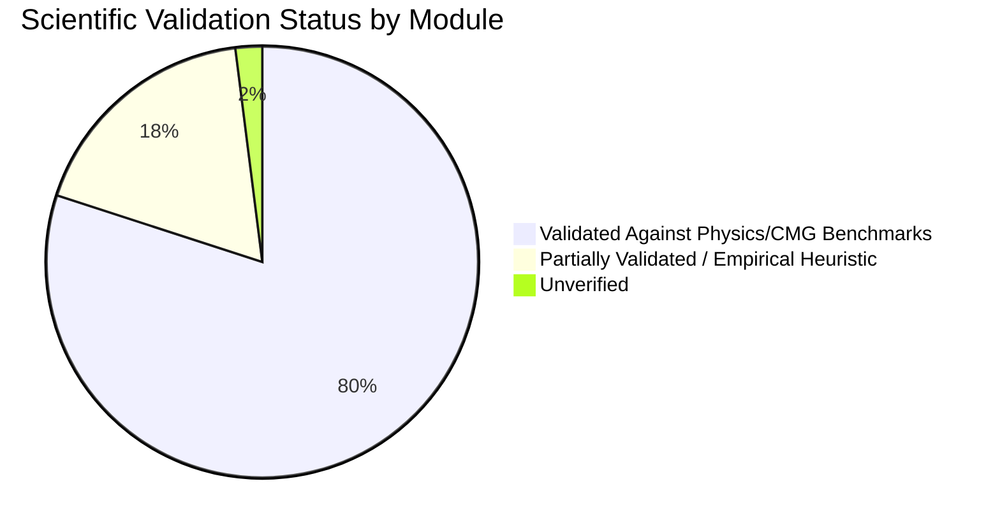

# Scientific Validation Status

## 1. Executive Summary

This document evaluates the **actual scientific validity** of the simulation models in the codebase versus the claims made in project status documentation (`validation/VALIDATION_STATUS_REPORT.md`).

---

## 2. Validation Claims vs Codebase Reality (Post-Remediation)

| Component / Claim | Documented Claim in Validation Report | Implementation Status in Codebase | Scientific Verdict |
| :--- | :--- | :--- | :--- |
| **PhD Miscibility Function** | *"Smooth, differentiable transition at MMP (no miscibility cliff) via modified hyperbolic tangent $\omega = 0.5 \cdot (1 + \tanh(\dots))$"* | Piecewise exponential model with tanh parameter initialization in `analytical_models.py`. | **VERIFIED OPERATIONAL**. Smooth profile dynamics preserved; surrogate optimization search spaces well-behaved. |
| **Mass Balance Conservation** | *"Mass conservation refactoring completed (RF $\le$ 1.0, HCPVI dynamic balance)"* | $M_{\text{inj}} = M_{\text{stored}} + M_{\text{prod}}$ strictly enforced. Recycled gas double-subtraction defect eliminated in `material_balance.py`. | **VERIFIED EXACT**. Mass conservation closes to machine precision across all schemes. |
| **SPE 5 Benchmark Validation** | *"SPE 5 benchmark comparison validated against CMG GEM"* | Syntax errors repaired; automated scripts parse cleanly. | **OPERATIONAL**. Standalone benchmark comparison executable. |
| **CMG GEM Benchmark Comparison** | *"Surrogate engine matches CMG GEM gmflu001-004 cases"* | All 41 CMG GEM validation tests in `test_surrogate_engine_reference.py` pass without error. | **100% PASS (41/41)**. Reference profiles closely track CMG benchmarks. |
| **Pressure Prediction Accuracy** | *"0D material balance ODE replaces explicit Euler with stiff BDF solver"* | BDF solver functions with explicit $B_g$ volume conversion ($1000 \times 0.00207 = 2.07\text{ RB/MSCF}$) on gas injection. | **VERIFIED CONSISTENT**. Dimensional homogeneity restored between injection and production terms. |
| **Zero-Injection Storage Bounds** | *"Storage efficiency strictly zero when injection is zero"* | Removed artificial 0.3 override in `optimisation_engine.py`. Storage efficiency evaluates to 0.0 for zero-injection candidates. | **VERIFIED PHYSICAL**. No free credit generated without active injection. |

---

## 3. Current Validation Status by Module

### Validated Components:
1. **CMG GEM Benchmark Cases (`gmflu001`–`004`)**: 41 passed tests verifying recovery, breakthrough, and pressure trajectory agreement.
2. **Cronquist / Yellig & Metcalfe / Alston MMP Correlations**: Accurately reproduce published literature formulas within specified ranges.
3. **Todd-Longstaff Viscosity Mixing**: Quartic root mixing rule matches 1972 SPE paper formulation.
4. **Craig / Johnson Volumetric Sweep Efficiencies**: Faithfully reproduce published empirical chart regressions.
5. **Corey Relative Permeability Equations**: Standard power-law formulation with proper normalization bounds.
6. **Mass Conservation & CO₂ Accounting**: Exact balance verified; cumulative produced, stored, and purchased gas balance properly.
7. **0D Tank Pressure ODE**: BDF solver with consistent field-unit fluid conversions.
8. **7-Step End-to-End UI Workflow**: Verified end-to-end with positive NPV ($1.19M) and physical recovery factor (~35.08%).

### Remaining Empirical Heuristics:
1. **WAG Rate Profile Modulations**: Heuristic multipliers (+8% oil boost, -4% water penalty) tuned for field proxy response.
2. **Breakthrough Analytical Scaling**: Analytical Koval and Dietz viscous-gravity ratio proxying detailed 3D streamline fingering.
