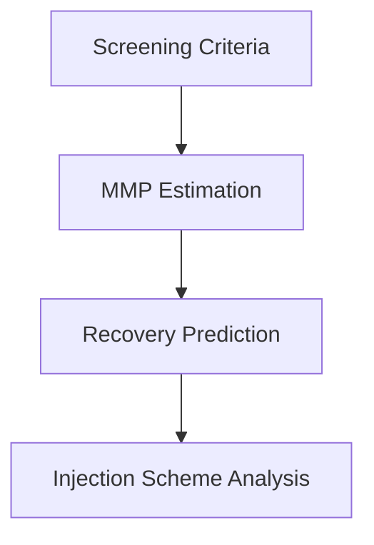
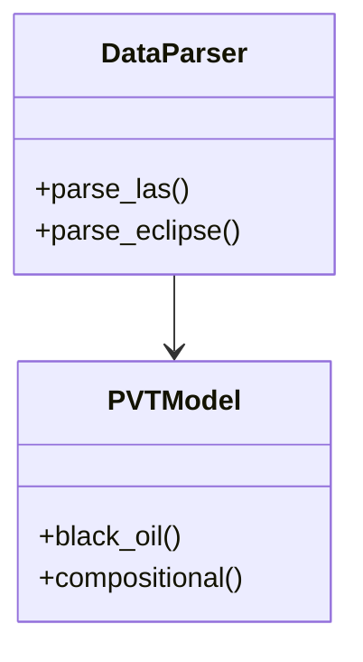

# CO2 EOR Optimization System Architecture

## Overview
Modular Python application for evaluating and optimizing CO2-based Enhanced Oil Recovery methods with GPU acceleration.

## Core Components

### 1. Data Layer
- **Formats Supported**:
  - LAS (well logs)
  - ECLIPSE 100 (GRID, PROPS, REGIONS, SOLUTION, SCHEDULE)
- **Key Features**:
  - Automatic unit conversion
  - Data validation
  - Missing value handling

### 2. PVT Modeling
- **Models**:
  - Black Oil
  - Compositional (EOS)
- **MMP Estimation**:
  - Multiple empirical correlations
  - Miscibility condition checking

### 3. EOR Evaluation Engine

### 4. Optimization System
- **Hybrid Approach**:
  1. Genetic Algorithm (global search)
  2. Bayesian Optimization (local refinement)
- **GPU Acceleration**:
  - CUDA kernels for performance-critical sections
  - Parallel scenario evaluation

### 5. Visualization & Reporting
- Interactive Plotly dashboards
- PDF/CSV report generation
- 3D reservoir visualization

## Class Diagram

## Development Roadmap
1. **Phase 1**: Core data structures (2 weeks)
2. **Phase 2**: PVT & MMP models (3 weeks)
3. **Phase 3**: Optimization engine (3 weeks)