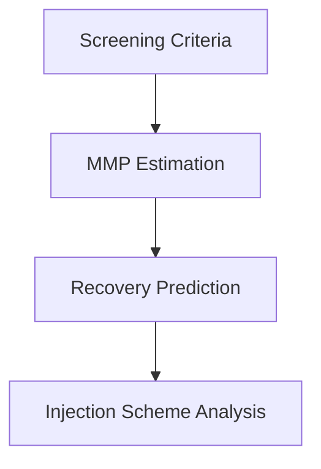
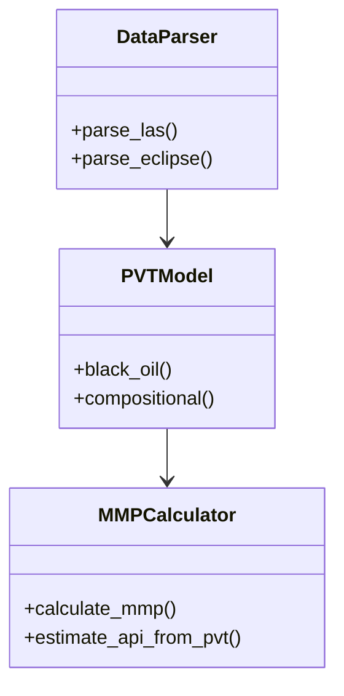
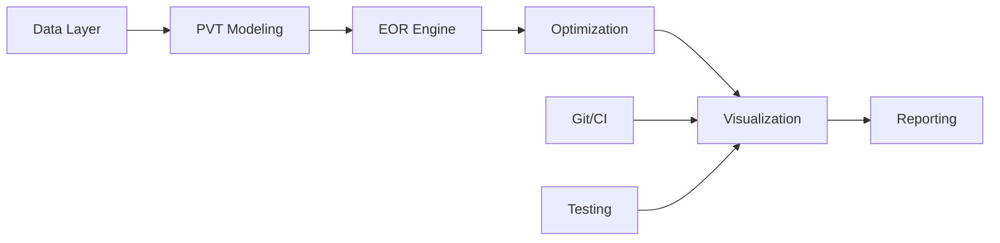

# CO2 EOR Optimization System Architecture

## Overview
Modular Python application for evaluating and optimizing CO2-based Enhanced Oil Recovery methods with GPU acceleration.

## Core Components

### 1. Data Layer
- **Formats Supported**:
  - LAS (well logs)
  - ECLIPSE 100 (GRID, PROPS, REGIONS, SOLUTION, SCHEDULE)
- **Key Features**:
  - Automatic unit conversion
  - Data validation
  - Missing value handling

### 2. PVT Modeling

### 3. Well Analysis
- **Purpose**: Bridge between well log data and EOR optimization
- **Key Features**:
  - Depth-dependent MMP calculations
  - Temperature gradient analysis (0.01°F/ft default)
  - API gravity estimation from density logs (RHOB)
  - Miscible zone identification
- **Integration Points**:
  - Input: LAS parser output (WellData)
  - Output: MMPCalculator inputs
  - Visualization: 3D miscibility maps
- **Models**:
  - Black Oil
  - Compositional (EOS)
- **MMP Estimation**:
  - Multiple empirical correlations:
    * Cronquist (pure CO2)
    * Glaso (C7+ adjustment)
    * Yuan (impure CO2)
  - Input validation (temperature, API gravity ranges)
  - Automatic PVT data integration
  - Miscibility condition checking

### 3. EOR Evaluation Engine

### 4. Optimization System
- **Hybrid Approach**:
  1. Genetic Algorithm (global search)
  2. Bayesian Optimization (local refinement)
- **GPU Acceleration**:
  - CUDA kernels for performance-critical sections
  - Parallel scenario evaluation

### 5. Visualization System
- **Real-time Development Tracking**:
  - Commit activity heatmaps
  - Code churn analysis
  - Team contribution breakdowns
- **Quality Metrics**:
  - Test coverage timelines
  - Defect density charts
  - Build success rates
- **Deployment Visualization**:
  - Pipeline Gantt charts
  - Environment health indicators
  - Rollback frequency tracking

### 6. Reporting
- Interactive Plotly dashboards
- PDF/CSV report generation
- 3D reservoir visualization
- Automated metric exports

## Class Diagram

## System Integration

## Development Roadmap
1. **Phase 1**: Core data structures (2 weeks)
2. **Phase 2**: PVT & MMP models (Completed)
   - Implemented core MMP correlations
   - Added PVT integration
   - Comprehensive test coverage
3. **Phase 3**: Optimization engine (3 weeks)
4. **Phase 4**: Visualization system (2 weeks)