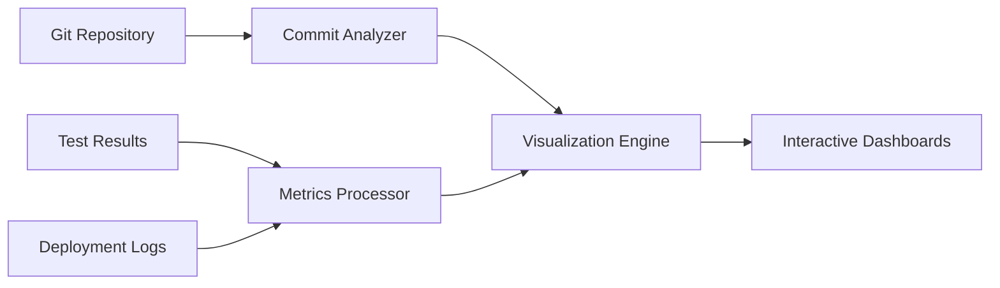

# CO2 EOR Optimization Visualization System

## Dashboard Architecture



## Core Visualization Components

### 1. Development Progress Dashboard
- **Commit Activity Heatmap**
  - X-axis: Weeks
  - Y-axis: Days
  - Color intensity: Number of commits
  - Filter by: Developer, Module

- **Code Churn Graph**
  - Lines added/removed per module
  - Stacked area chart showing trends

### 2. Testing & Quality Dashboard
- **Test Coverage Timeline**
  - Line chart showing coverage % over time
  - Breakdown by module

- **Test Results Matrix**
  - Heatmap of pass/fail status
  - Group by test category

### 3. Deployment Pipeline View
- **Gantt Chart**
  - Phases with dependencies
  - Current progress markers
  - Critical path highlighting

- **Deployment Health**
  - Success/failure rate
  - Rollback frequency

## Technical Implementation

### Data Sources
1. Git History (`git log --pretty=format:'%h|%an|%ad|%s' --date=short --numstat`)
2. Test Results (pytest JSON output)
3. CI/CD Logs
4. Manual Milestone Tracking

### Visualization Libraries
- **Primary**: Plotly Dash (Python)
- **Secondary**: D3.js (for custom visualizations)
- **Static Reports**: Matplotlib/Seaborn

### Interactive Features
- Timeframe selection (slider)
- Module/team member filters
- Drill-down capabilities
- Export to PNG/PDF

## Integration Points
1. **Git Hook** - Automatically update commit metrics
2. **Test Runner** - Post-process results
3. **CI Pipeline** - Deployment event tracking
4. **Manual Input** - Milestone completion

## Sample Dashboard Layout

```mermaid
graph TD
    A[Header - Project Status] --> B[Commit Activity]
    A --> C[Test Coverage]
    A --> D[Deployment Progress]
    B --> E[Filters Panel]
    C --> E
    D --> E

## Reservoir Engineering Visualizations

### 1. MMP Analysis
- **MMP vs Temperature**:
  - Plot multiple correlations
  - Highlight miscibility region
  - Interactive API gravity slider

- **Gas Composition Sensitivity**:
  - Ternary diagrams for CO2/CH4/N2
  - MMP contour plots
  - Miscibility boundaries

### 2. PVT Visualization
- **Fluid Property Plots**:
  - Oil FVF vs Pressure
  - Viscosity trends
  - Solution GOR curves

### Implementation Notes
- Uses Plotly for interactive 3D plots
- Matplotlib for static reports
- Export to PNG/PDF for documentation